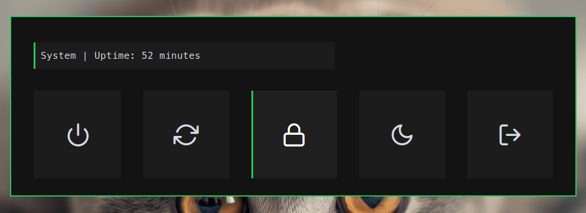
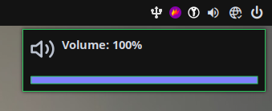

# Xmonad configuration

[Xmonad](https://github.com/xmonad/xmonad) is a dynamic window manager written in Haskell, known for its efficiency and flexibility. This repository contains my configuration for the xmonad window manager. 


## Rofi

My configuration is using [rofi](https://github.com/davatorium/rofi) for application launching also it's configured to work as powermenu

<p align="center" width="100%">
    
</p>
<p align="center" width="100%">
    
</p>

## Volume control and notifications

For notifications i use [dunst](https://github.com/dunst-project/dunst). Also when volume control keys are used notification appears with current volume, progress bar and icons

<p align="center" style="display: flex;">
    
    
    
</p>


## Audio control

My setup using special keys on keyboard to play, pause, and change songs in a few music players. It's using this script `scripts/spotify-ctrl`:

```bash
#! /bin/bash
players=("strawberry" "spotify" "DeaDBeeF")

function currentPlayer() {
    for p in ${players[*]}; do
        status=$(dbus-send --print-reply --dest=org.mpris.MediaPlayer2.$p /org/mpris/MediaPlayer2 org.freedesktop.DBus.Properties.Get string:'org.mpris.MediaPlayer2.Player' string:'PlaybackStatus' 2> /dev/null | grep -E -A 1 "string"|cut -b 26-|cut -d '"' -f 1|grep -E -v ^$)
        if [ "$status" == "Playing" ] || [ "$status" == "Paused" ]; then
            echo $p
        fi
    done
}

player=$(currentPlayer)

function play() {
    dbus-send --print-reply --dest=org.mpris.MediaPlayer2.$player /org/mpris/MediaPlayer2 org.mpris.MediaPlayer2.Player.$1 1> /dev/null
}

function status() {
    dbus-send --print-reply --dest=org.mpris.MediaPlayer2.$player /org/mpris/MediaPlayer2 org.freedesktop.DBus.Properties.Get string:'org.mpris.MediaPlayer2.Player' string:'PlaybackStatus'|grep -E -A 1 "string"|cut -b 26-|cut -d '"' -f 1|grep -E -v ^$
}

case $1 in
next)
    play Next
	;;
prev)
    play Previous	
	;;
toggle)
    play PlayPause	
	;;
status)
    echo $(status)	
	;;
esac
```

